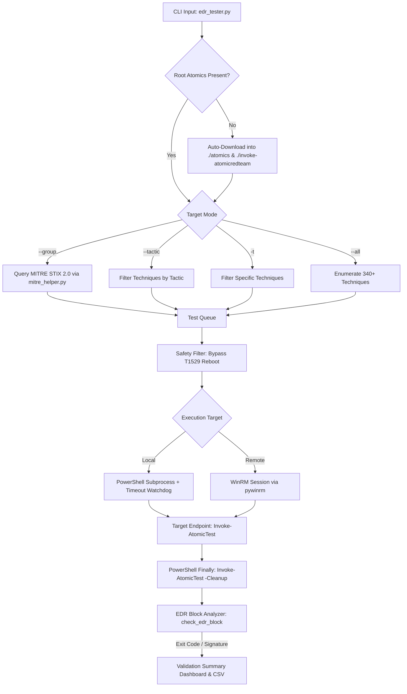

# Edrtest

[](https://www.python.org/)
[](LICENSE)
[](https://attack.mitre.org/)
[](https://github.com/redcanaryco/atomic-red-team)

**Edrtest** is a resilient, cross-platform Python orchestration harness and automation port for [Invoke-AtomicRedTeam](https://github.com/redcanaryco/invoke-atomicredteam) and [mitreattack-python](https://github.com/mitre-attack/mitreattack-python). Designed for Security Operations Centers (SOC), Detection Engineers, and Purple Teams to validate Endpoint Detection and Response (EDR) sensors, behavioral telemetry collection, and SIEM alerting pipelines against the **MITRE ATT&CK® Enterprise Matrix**.

---

> [!CAUTION]
> **LEGAL & OPERATIONAL WARNING / DISCLAIMER**
> 
> - **Defensive Testing Only:** This tool generates real adversarial activity patterns (such as credential dumping commands, service installation, process injection simulations, and registry modifications) designed to test endpoint security software.
> - **Authorization Required:** Only execute this software against systems and networks that you own or have explicit, formal, written permission to test. Unauthorized execution may violate federal, state, and international cybercrime legislation (e.g., Computer Fraud and Abuse Act - 18 U.S.C. § 1030).
> - **Production Safety:** Do not execute batch testing (`--all` or broad tactics) in production environments without appropriate change-control and SOC notification. Although disruptive actions like system reboots (`T1529`) are bypassed by default, tests can generate heavy security event volume or trigger host isolation.

---

## Table of Contents

- [Key Capabilities](#key-capabilities)
- [Architecture & Execution Pipeline](#architecture--execution-pipeline)
- [Quick Start (Zero-Config Setup)](#quick-start-zero-config-setup)
- [Complete CLI Command Reference](#complete-cli-command-reference)
- [Threat Actor Emulation](#threat-actor-emulation)
- [EDR Block Detection & Resilience](#edr-block-detection--resilience)
- [Automatic Post-Test Cleanup](#automatic-post-test-cleanup)
- [Remote Execution (WinRM)](#remote-execution-winrm)
- [In-Depth Documentation Guides](#in-depth-documentation-guides)
- [Attribution & Port Details](#attribution--port-details)
- [License](#license)

---

## Key Capabilities

1. **Zero-Config Self-Bootstrapping:**
   Cloning the repository and running any command automatically deploys `Invoke-AtomicRedTeam` and the 340+ ATT&CK atomic tests directly into the project root directory. No manual file management required.
2. **EDR Block Detection & Continuation:**
   If Windows Defender, CrowdStrike, SentinelOne, or AppLocker blocks an atomic test, the runner intercepts the security event, records a **Defense Success**, and cleanly proceeds to the next test without aborting.
3. **Guaranteed Post-Test Artifact Cleanup (Default):**
   Every executed test automatically runs its corresponding cleanup routine via PowerShell `try ... finally` semantics. Dropped files (e.g. web shells in `C:\inetpub\wwwroot\`), dumped registry hives, and temporary services are wiped immediately after testing.
4. **Threat Actor Profile Emulation (`--group`):**
   Integrates official MITRE STIX 2.0 CTI to resolve techniques attributed to specific threat groups (e.g. `APT29`, `FIN7`, `Lazarus Group`, `G0082`) and execute tests matching their known tactics.
5. **Dual Local & Remote WinRM Execution:**
   Run tests locally via PowerShell or remotely across your network to Windows 10/11 and Windows Server endpoints via WinRM.
6. **Execution Safety Guards:**
   - Destructive reboot commands (`T1529`) are automatically bypassed during batch runs.
   - Per-test watchdog timeouts (default: 25s) terminate hung GUI processes (e.g. `mstsc.exe`, interactive prompts).

---

## Architecture & Execution Pipeline



For full architectural specifications, see [docs/ARCHITECTURE.md](docs/ARCHITECTURE.md).

---

## Quick Start (Zero-Config Setup)

### 1. Clone & Install Dependencies
```bash
git clone https://github.com/oyesanyf/Edrtest.git
cd Edrtest
pip install -r requirements.txt
```

### 2. Run Your First Test
Run any test command. On the first run, the runner will automatically download and deploy the Atomic Red Team framework into the project root:
```bash
python edr_tester.py -t T1082 -n 1 --local -a execute
```

*(You can also explicitly pre-install anytime via `python edr_tester.py --get-atomics`)*.

---

## Complete CLI Command Reference

```text
usage: edr_tester.py [-h] [-t TECHNIQUE [TECHNIQUE ...]] [--matrix]
                     [--tactic TACTIC] [--group GROUP] [--info INFO]
                     [--all] [--list-techniques] [-n TEST_NUMBER]
                     [-a {show,check,get_prereqs,execute,cleanup}]
                     [--atomics-path ATOMICS_PATH] [--module-path MODULE_PATH]
                     [--local] [--remote] [--host HOST] [--user USER]
                     [--password PASSWORD] [--port PORT] [--force]
                     [--report REPORT] [--timeout TIMEOUT] [--include-reboot]
                     [--no-cleanup] [--get-atomics]
```

### Argument Reference Table

| Category | Flag | Argument | Default | Description |
| :--- | :--- | :--- | :--- | :--- |
| **Setup** | `--get-atomics` | None | Flag | Downloads and installs `Invoke-AtomicRedTeam` and all 340+ atomics directly into `./atomics` and `./invoke-atomicredteam`. |
| **Selection** | `-t`, `--technique` | `ID [ID ...]` | `None` | One or more ATT&CK technique IDs (e.g. `-t T1082 T1033` or `-t T1082,T1033`). |
| | `--all` | None | Flag | **Master Run.** Executes every test across all 340+ techniques in sequence with isolated timeouts and progress tracking. |
| | `--tactic` | `NAME` | `None` | Target all techniques under a specific tactic (e.g. `discovery`, `execution`, `credential-access`, `persistence`). |
| | `--group` | `NAME` | `None` | Target all techniques attributed to a specific threat actor in MITRE CTI (e.g. `APT29`, `FIN7`, `Lazarus Group`). |
| | `--info` | `T_ID` | `None` | Look up official MITRE ATT&CK CTI description, detection data sources, and known threat actors for a technique. |
| | `--matrix` | None | Flag | Display the complete MITRE ATT&CK Enterprise Matrix coverage breakdown and test counts. |
| | `--list-techniques`| None | Flag | Quick terminal listing of all available technique folders in the atomics directory. |
| | `-n`, `--test-number` | `INT` | `None` | Specific atomic test index (1-based integer). Omit to run all tests under the technique. |
| **Action** | `-a`, `--action` | `ACTION` | `execute` | Lifecycle action: `execute`, `cleanup`, `check` (prereqs), `get_prereqs`, `show`. |
| | `--no-cleanup` | None | Flag | Disable automatic post-test artifact cleanup (**cleanup is enabled by default**). |
| **Safety** | `--timeout` | `SECONDS` | `25` | Watchdog timeout per test before terminating hung GUI processes. |
| | `--include-reboot` | None | Flag | Include `T1529` (System Shutdown/Reboot) during batch runs (excluded by default for safety). |
| | `--force` | None | Flag | Force execution without interactive confirmation prompts (automatically set with `--all`). |
| **Targeting** | `--local` | None | Default | Execute against the local machine via PowerShell. |
| | `--remote` | None | Flag | Execute against a remote endpoint via WinRM (`pywinrm`). |
| | `--host` | `IP / HOST` | `None` | Remote target IP address or hostname. |
| | `--user` | `USERNAME` | `None` | Remote administrator username (`DOMAIN\User` or `User`). |
| | `--password` | `PASSWORD` | `None` | Remote administrator password. |
| | `--port` | `PORT` | `5985` | Remote WinRM port (`5985` for HTTP, `5986` for HTTPS). |
| **Reporting** | `--report` | `PATH` | `None` | Save CSV execution log via `Default-ExecutionLogger`. |
| **Overrides**| `--atomics-path` | `PATH` | `./atomics` | Override atomics folder directory. |
| | `--module-path` | `PATH` | `./invoke-...` | Override `Invoke-AtomicRedTeam.psd1` file path. |

---

## Practical Examples

### 1. Master Run (Validate Everything)
Executes every test across all 340+ techniques with automatic EDR block continuation and post-test cleanup:
```bash
python edr_tester.py --all
```

### 2. Threat Actor Emulation (`APT29`)
Queries MITRE STIX CTI for techniques used by APT29 and executes matching local atomics:
```bash
python edr_tester.py --group "APT29" --local -a execute --timeout 20
```

### 3. Tactic Benchmark (Credential Access)
Tests all credential access techniques (SAM dumps, LSASS access, credential vaults):
```bash
python edr_tester.py --tactic credential-access --local -a execute
```

### 4. Multi-Technique Batch
```bash
python edr_tester.py -t T1082,T1033,T1016 --local -a execute
```

### 5. Remote Testing via WinRM
Executes against a remote host on your network:
```bash
python edr_tester.py -t T1082 --remote \
  --host 10.0.0.165 \
  --user "Administrator" \
  --password "TargetPassword123!"
```

### 6. CTI Intel Query
Inspect detection components, description, and threat actors for a technique:
```bash
python edr_tester.py --info T1059.001
```

### 7. Matrix Breakdown View
```bash
python edr_tester.py --matrix
```

---

## Threat Actor Emulation

Edrtest integrates with the official MITRE ATT&CK STIX 2.0 dataset via [`mitre_helper.py`](file:///d:/harfile/edrtest/mitre_helper.py).

When `--group <NAME>` is invoked:
1. Queries the enterprise STIX bundle for the group name, ID (`G0016`), or alias (`Cozy Bear`, `Nobelium`, `Dark Halo`).
2. Traverses ATT&CK `relationship` objects to identify all attributed techniques.
3. Cross-references the actor's techniques with your local `atomics` folder.
4. Executes the campaign in sequence with telemetry collection and defensive summary reporting.

```text
[*] Found Threat Group: APT29 (ID: G0016)
[*] Known Aliases: APT29, IRON RITUAL, IRON HEMLOCK, NobleBaron, Dark Halo, NOBELIUM
[*] Attributed Techniques: 119
[*] 79 of 119 APT29 techniques exist in your local Atomic library.
```

---

## EDR Block Detection & Resilience

When security products (Windows Defender, CrowdStrike, SentinelOne, AppLocker, WDAC) block a test, Edrtest does **not** crash or abort.

### Interception Detection Engine:
The `check_edr_block()` function monitors:
- **Output Signatures:** Matches patterns such as `Access is denied`, `virus`, `malware`, `operation was blocked`, `blocked by group policy`, `prevented by app control`.
- **Exit Codes:** Recognizes `5` (`ERROR_ACCESS_DENIED`), `225` (`ERROR_VIRUS_INFECTED`), `1260` (AppLocker/WDAC policy block), and `3221225477` (AV injection crash).

When detected, it outputs:
```text
[*** EDR / DEFENDER INTERVENTION DETECTED ***]
[+] Action was BLOCKED or DENIED by security controls.
[+] Result: DEFENSE SUCCESS (Continuing automatically to next test...)
```
and automatically updates the final detection metrics.

For detection engineering guidance and event log mapping, see [docs/DETECTION_ENGINEERING.md](docs/DETECTION_ENGINEERING.md).

---

## Automatic Post-Test Cleanup

By default, every test executed by Edrtest enters a guaranteed cleanup phase immediately following execution.

### How It Works:
- **PowerShell `try ... finally` Structure:** The test execution is wrapped in a `finally` block that triggers `Invoke-AtomicTest -Cleanup -Force`. Even if a test errors out, throws an exception, or is killed by an EDR, PowerShell runtime guarantees cleanup executes before exit.
- **Emergency Watchdog Cleanup:** If a test hangs and the Python subprocess watchdog terminates it, Python launches an emergency cleanup sweep to wipe remaining artifacts.
- **Opt-Out:** Forensic analysts inspecting live artifacts can pass `--no-cleanup` to leave files on disk.

---

## Remote Execution (WinRM)

Edrtest supports remote execution against Windows 10, Windows 11, and Windows Server endpoints via WinRM:

1. Target host must have PowerShell remoting enabled:
   ```powershell
   Enable-PSRemoting -Force
   ```
2. For workgroup / local accounts, disable UAC remote restrictions on the target:
   ```powershell
   New-ItemProperty -Path "HKLM:\SOFTWARE\Microsoft\Windows\CurrentVersion\Policies\System" `
     -Name "LocalAccountTokenFilterPolicy" -Value 1 -PropertyType DWORD -Force
   ```

For comprehensive network setup, firewall rules, and domain configuration, see [docs/REMOTE_WINRM_GUIDE.md](docs/REMOTE_WINRM_GUIDE.md).

---

## In-Depth Documentation Guides

| Guide | Description |
| :--- | :--- |
| [**Architecture & System Design**](docs/ARCHITECTURE.md) | Deep dive into internal execution architecture, component interactions, and safety gates. |
| [**Detection Engineering Guide**](docs/DETECTION_ENGINEERING.md) | Guide for mapping atomic tests to Event IDs (4688, Sysmon, MDE KQL) and writing alert rules. |
| [**Remote WinRM Setup Guide**](docs/REMOTE_WINRM_GUIDE.md) | Complete instructions for configuring Windows endpoints and firewalls for remote WinRM testing. |

---

## Attribution & Port Details

This project is an automation and resilience **port** built on top of:
- **[Atomic Red Team™](https://github.com/redcanaryco/atomic-red-team)** by Red Canary.
- **[Invoke-AtomicRedTeam](https://github.com/redcanaryco/invoke-atomicredteam)** by Red Canary.
- **[mitreattack-python](https://github.com/mitre-attack/mitreattack-python)** by The MITRE Corporation.

---

## License

This project is licensed under the Apache 2.0 License - see the LICENSE file for details.  
Atomic Red Team is a registered trademark of Red Canary. MITRE ATT&CK is a registered trademark of The MITRE Corporation.
