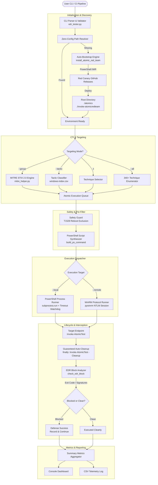

# Edrtest Architecture & System Design

This document details the internal architecture, component interactions, and execution lifecycle of the **Edrtest** framework.

---

## 1. System Architecture Diagram



---

## 2. Component Breakdown

### 2.1 CLI Parser & Command Dispatcher (`edr_tester.py`)
- Built with standard Python `argparse` with strict validation.
- Normalizes input arguments across:
  - Technique identifiers: Accepts comma-separated (`-t T1082,T1033`) or space-separated (`-t T1082 T1033`).
  - Tactile filters: Maps friendly tactic names (e.g. `discovery`, `credential-access`) to MITRE matrix keys.
  - Threat group identifiers: Resolves threat actors by proper name (`APT29`), common alias (`Cozy Bear`, `Nobelium`), or STIX ID (`G0016`).

### 2.2 Zero-Config Path Resolver & Auto-Bootstrap Engine
- **Priority Resolution:**
  1. Root folder relative paths: `.\atomics` and `.\invoke-atomicredteam\Invoke-AtomicRedTeam.psd1`.
  2. Legacy / local paths: `D:\tools\redteam\...` and `C:\AtomicRedTeam\...`.
- **Automatic First-Run Bootstrap:**
  When a cloned repository does not detect the library, `ensure_atomic_red_team()` invokes the official Red Canary installer script in PowerShell via TLS 1.2 download. The script downloads:
  - `invoke-atomicredteam` module source.
  - The entire `atomics` technique repository.
  - The required `powershell-yaml` parsing module.
- All files are placed directly in the repository root without polluting system global directories.

### 2.3 MITRE STIX 2.0 Threat Intelligence Layer (`mitre_helper.py`)
- Powered by `mitreattack-python` to query local STIX 2.0 bundles (`enterprise-attack.json`).
- If STIX data is missing from `./stix`, it downloads the latest Enterprise matrix bundle from MITRE CTI directly via HTTPS.
- Resolves actor profiles by traversing ATT&CK relationship objects (`uses` relationships between `intrusion-set` and `attack-pattern`).
- Computes coverage overlap between actor techniques and locally available atomic tests.

### 2.4 Command Synthesizer (`build_ps_command`)
- Generates dynamic PowerShell execution payloads.
- Applies standard security bypass parameters:
  ```powershell
  $ProgressPreference = 'SilentlyContinue'
  Set-ExecutionPolicy -ExecutionPolicy Bypass -Scope Process -Force
  Import-Module '{module_path}' -Force
  $PSDefaultParameterValues['Invoke-AtomicTest:PathToAtomicsFolder'] = '{atomics_path}'
  ```
- Synthesizes the core test execution wrapped in a structural `try ... finally` block ensuring post-test cleanup runs regardless of script exceptions, EDR termination, or syntax errors.

---

## 3. EDR Interception & Resilience Engine

A primary flaw of basic test runners is aborting when an endpoint security product blocks an atomic test. Edrtest treats an EDR block not as a runtime failure, but as a **successful defensive intervention**.

### 3.1 Detection Mechanism (`check_edr_block`)
The engine inspects three telemetry surfaces for every executed atomic test:

1. **Standard Output & Standard Error Pattern Matching:**
   Scans output streams for definitive security vendor indicators:
   - `access is denied`
   - `file contains a virus`
   - `potentially unwanted software`
   - `blocked by group policy`
   - `blocked by your administrator`
   - `blocked by app control` / `prevented by app control`
   - `windows defender has blocked`
   - `operation was blocked`
   - `a required privilege is not held`
   - `unauthorizedaccess`

2. **Windows Security Exit Codes:**
   | Exit Code | Windows Error Constant | Description |
   | :--- | :--- | :--- |
   | `5` | `ERROR_ACCESS_DENIED` | Process denied handle, token, or file access by security policy or kernel filter driver. |
   | `225` | `ERROR_VIRUS_INFECTED` | Operation stopped because file contains malware / virus (Windows Defender). |
   | `1260` | `ERROR_KM_DRIVER_BLOCKED` | Program blocked by Group Policy, AppLocker, or Windows Defender Application Control (WDAC). |
   | `-1073741819` / `3221225477` | `STATUS_ACCESS_VIOLATION` | Process crashed or killed abruptly by EDR injection hook. |

3. **Subprocess Watchdog Timers:**
   - GUI commands (e.g. `mstsc.exe`, `wmic` interactive mode, `calc.exe`) run headlessly in automated environments and can hang indefinitely.
   - The watchdog enforces a strict execution window (`--timeout`, default 25 seconds). If exceeded, it terminates the process tree and triggers an emergency cleanup sweep.

---

## 4. Lifecycle & Guaranteed Auto-Cleanup

Security testing on endpoints must never leave persistent artifacts that compromise operational hygiene.

### 4.1 Native PowerShell `try ... finally` Structure
Every atomic command synthesized by `build_ps_command` adheres to this structure:

```powershell
try {
    Invoke-AtomicTest T1003.002 -PathToAtomicsFolder '.\atomics' -TestNumbers 1 -Force -TimeoutSeconds 25
} finally {
    Write-Host "`n[*] Auto-cleaning up test artifacts for T1003.002..."
    Invoke-AtomicTest T1003.002 -PathToAtomicsFolder '.\atomics' -TestNumbers 1 -Cleanup -Force -TimeoutSeconds 25 -ErrorAction SilentlyContinue
    Write-Host "[+] Cleanup completed for T1003.002`n"
}
```

### 4.2 Why This Architecture is Robust:
1. **Uninterrupted by Script Exceptions:** Even if `Invoke-AtomicTest` encounters a terminating error, PowerShell runtime semantics guarantee the `finally` block executes before the process terminates.
2. **Identical Across Remote WinRM:** Because cleanup is compiled directly into the script payload, remote hosts execute cleanup in the same remote session without requiring extra network round-trips.
3. **Emergency Fallback on Subprocess Timeout:** If the Python runtime kills the PowerShell process before it completes, Python spawns a dedicated, isolated cleanup command to wipe remaining artifacts.

---

## 5. Security & Safety Gates

- **Disruptive Command Filtering:**
  Techniques that shut down or reboot endpoints (`T1529`) are automatically omitted during batch execution (`--all`, `--tactic`, `--group`) unless `--include-reboot` is explicitly passed.
- **Process Scope Execution Policy:**
  Execution policies are set with `-Scope Process -Force` to avoid modifying system-wide registry configurations (`LocalMachine` or `CurrentUser`).
