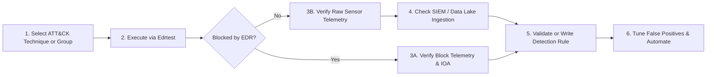

# Detection Engineering & EDR Telemetry Validation Guide

This guide describes how to utilize **Edrtest** to systematically test, benchmark, and improve detection coverage in your Security Operations Center (SOC) or Detection Engineering workflow.

---

## 1. The Detection Engineering Lifecycle



---

## 2. Telemetry Sources & Event Mapping

When an atomic test executes, it interacts with OS APIs, kernel objects, the file system, network interfaces, and registry keys. Detection engineers should observe the following telemetry streams:

### 2.1 Windows Security Audit Log (Native ETW)

| Event ID | Event Name | Relevance in Atomic Testing | Example Techniques |
| :--- | :--- | :--- | :--- |
| **4688** | A new process has been created | Validates parent-child relationships, command-line arguments, and token elevation. | `T1082`, `T1059.001`, `T1033` |
| **4624** | An account was successfully logged on | Validates WinRM remote executions (`LogonType 3`), RDP sessions (`LogonType 10`), and service logons. | `T1021.001`, `T1021.002` |
| **4672** | Special privileges assigned to new logon | Verifies administrator token assignment (SeDebugPrivilege, SeBackupPrivilege). | `T1003.002`, `T1003.006` |
| **7045** | A new service was installed in the system | Validates detection of persistence mechanisms installed as Windows services. | `T1543.003` |
| **1102** | The audit log was cleared | Validates alerts on defense evasion targeting event logs. | `T1070.001` |
| **4698** | A scheduled task was created | Validates detection of tasks scheduled via `schtasks` or PowerShell. | `T1053.005` |

### 2.2 Microsoft Sysmon (System Monitor)

| Event ID | Event Name | Data Validated |
| :--- | :--- | :--- |
| **1** | Process Creation | Full command line, hashes (MD5/SHA256), parent process, user context, integrity level. |
| **3** | Network Connection | Destination IP, destination port, initiating process, protocol (WinRM port 5985/5986, RDP port 3389). |
| **7** | Image Loaded | DLL loads into processes (e.g. `samlib.dll`, `vaultcli.dll`). |
| **8** | CreateRemoteThread | Remote thread injection into system processes (`lsass.exe`, `explorer.exe`). |
| **10** | ProcessAccess | Handle requests to sensitive processes (Target: `lsass.exe` with access masks `0x1010`, `0x1F0FFF`). |
| **11** | FileCreate | Files written to sensitive locations (`C:\inetpub\wwwroot\`, `%TEMP%`, startup folders). |
| **12 / 13** | RegistryEvent | Registry key/value creation and modification (Run keys, ServiceImagePath, Security Provider DLLs). |
| **22** | DNSEvent | DNS queries triggered by network and C2 discovery techniques. |

### 2.3 Cloud EDR Telemetry Tables

| EDR Platform | Primary Process Table | File Modification Table | Registry Table | Network Table |
| :--- | :--- | :--- | :--- | :--- |
| **Defender for Endpoint (MDE)** | `DeviceProcessEvents` | `DeviceFileEvents` | `DeviceRegistryEvents` | `DeviceNetworkEvents` |
| **CrowdStrike Falcon** | `ProcessRollup2` | `FileWritten` | `RegKeyCreated` | `NetworkConnectIP4` |
| **SentinelOne** | Deep Visibility: `Process Creation` | Deep Visibility: `File Creation` | Deep Visibility: `Registry Write` | Deep Visibility: `Network Action` |

---

## 3. Practical Detection Playbooks

### Playbook 1: Credential Access (SAM Registry Dump - `T1003.002`)

- **Objective:** Detect unauthorized saving of the SAM and SYSTEM registry hives to disk.
- **Execution:**
  ```powershell
  python edr_tester.py -t T1003.002 -n 1 --local -a execute
  ```
- **What Happens:**
  Executes `reg.exe save HKLM\SAM %TEMP%\sam` and `reg.exe save HKLM\SYSTEM %TEMP%\system`.
- **Expected Telemetry (MDE Advanced Hunting):**
  ```kusto
  DeviceProcessEvents
  | where ProcessCommandLine has_all ("reg", "save", "hklm\\sam")
     or ProcessCommandLine has_all ("reg", "save", "hklm\\system")
  | project Timestamp, DeviceName, AccountName, FileName, ProcessCommandLine, InitiatingProcessFileName
  ```
- **Expected Defense Behavior:**
  If Tamper Protection or Credential Guard is active, this action will return `Access is denied` (Exit Code 5). Edrtest will flag this as `[*** EDR / DEFENDER INTERVENTION DETECTED ***]`, log a defense success, and immediately cleanup.

---

### Playbook 2: Persistence (Web Shell Drop - `T1505.003`)

- **Objective:** Validate real-time file-system detection of web shell payloads written to web roots.
- **Execution:**
  ```powershell
  python edr_tester.py -t T1505.003 -n 1 --local -a execute
  ```
- **What Happens:**
  Attempts to copy `tests.jsp` and `cmd.aspx` into `C:\inetpub\wwwroot\`.
- **Expected Telemetry (Sysmon Event ID 11 / MDE DeviceFileEvents):**
  ```kusto
  DeviceFileEvents
  | where FolderPath has @"\inetpub\wwwroot"
  | where FileName endswith ".jsp" or FileName endswith ".aspx"
  | project Timestamp, DeviceName, ActionType, FileName, FolderPath, InitiatingProcessFileName
  ```
- **Expected Defense Behavior:**
  Windows Defender or your EDR's real-time AV filter intercepts the file creation with signature `Backdoor:PHP/Remoteshell.V` and quarantines the file immediately.

---

### Playbook 3: Threat Actor Emulation (`APT29`)

- **Objective:** Test end-to-end detection and alert correlation for a comprehensive adversary campaign.
- **Execution:**
  ```powershell
  python edr_tester.py --group "APT29" --local -a execute --timeout 20
  ```
- **Workflow:**
  1. Edrtest queries STIX 2.0 to resolve all 119 techniques attributed to APT29.
  2. Identifies matching local atomic tests (e.g. 79 techniques).
  3. Executes each technique with isolated progress, 20-second timeout watchdog, EDR block continuation, and automatic post-test cleanup.
- **Expected EDR Outcome:**
  Your SOC console should display an incident correlating multiple alert categories:
  - Initial Reconnaissance & Discovery (`T1082`, `T1033`, `T1016`)
  - Defense Evasion attempts (`T1070`, `T1112`)
  - Credential Access alerts (`T1003`)
  - C2 and Persistence mechanisms

---

## 4. Analyzing the Validation Summary

When Edrtest finishes a batch, it renders the summary dashboard:

```text
==============================================================
                 EDR VALIDATION SUMMARY
==============================================================
  Total Techniques Processed  : 79 / 79
  Executed Cleanly (Unblocked): 58
  Blocked / Denied by EDR     : 18
  Timed Out (Safety killed)   : 3
==============================================================
```

### How to Interpret the Metrics:
- **Executed Cleanly (Unblocked):**
  The command executed to completion without being killed or blocked.
  *Action Item:* Review your SIEM/EDR console to verify that **detection alerts or telemetry logs** were captured. If no alert was raised and the command is malicious, you have a **detection gap**.
- **Blocked / Denied by EDR:**
  The command was actively intercepted by real-time protection, AppLocker, or an EDR behavioral rule.
  *Action Item:* Verify that an **Incident or Alert** was logged in your EDR console corresponding to the block.
- **Timed Out:**
  The command launched a process that did not exit within the timeout window (usually a GUI application like Remote Desktop or an interactive utility).
  *Action Item:* Edrtest terminated the process and ran an emergency cleanup to maintain endpoint hygiene.
