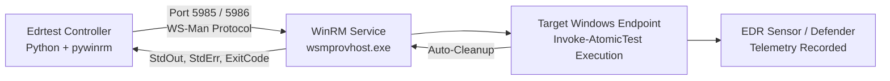

# Remote Windows Endpoint Setup Guide (WinRM)

This guide provides step-by-step instructions for preparing remote Windows endpoints (Windows 10, Windows 11, and Windows Server 2016–2025) to accept remote test execution from **Edrtest** via Windows Remote Management (WinRM).

---

## 1. How Remote Execution Works

Edrtest utilizes `pywinrm` to establish an authenticated HTTP/HTTPS management channel to target endpoints. 



---

## 2. Target Endpoint Configuration

Execute the following commands in an **elevated Administrator PowerShell session** on the target machine you wish to test:

### Step 1: Enable PowerShell Remoting
```powershell
Enable-PSRemoting -Force
```
This starts the `WinRM` service, sets the startup type to `Automatic`, and creates a firewall exception for inbound traffic on port 5985.

### Step 2: Verify WinRM Listener
```powershell
Get-ChildItem WSMan:\localhost\Listener
```
Ensure a listener is active on `Transport = HTTP` with `Port = 5985`.

### Step 3: Disable UAC Remote Restrictions (Workgroup / Local Accounts)
If testing a machine that is **not joined to an Active Directory domain** (e.g. testing in a standalone lab or using a local administrator account), Windows User Account Control (UAC) strips administrative privileges over remote network connections by default. Run:

```powershell
New-ItemProperty -Path "HKLM:\SOFTWARE\Microsoft\Windows\CurrentVersion\Policies\System" `
  -Name "LocalAccountTokenFilterPolicy" -Value 1 -PropertyType DWORD -Force
```

### Step 4: Verify Firewall Configuration
Ensure port 5985 is open for your controller IP:
```powershell
New-NetFirewallRule -Name "Edrtest-WinRM-In" `
  -DisplayName "Edrtest WinRM HTTP" `
  -Profile Any -Direction Inbound -Action Allow `
  -Protocol TCP -LocalPort 5985
```

---

## 3. Controller Machine Configuration

If your controller is running in a workgroup environment (non-domain), add the target host to your `TrustedHosts` list:

```powershell
Set-Item WSMan:\localhost\Client\TrustedHosts -Value "10.0.0.165" -Force
```
*(Or use `*` in isolated test lab environments)*:
```powershell
Set-Item WSMan:\localhost\Client\TrustedHosts -Value "*" -Force
```

To verify network reachability from the controller to the target:
```powershell
Test-NetConnection 10.0.0.165 -Port 5985
```

---

## 4. Running Remote Tests with Edrtest

### Basic Remote Execution
```bash
python edr_tester.py -t T1082 --remote \
  --host 10.0.0.165 \
  --user "Administrator" \
  --password "TargetPassword123!"
```

### Domain Account Authentication
In an Active Directory environment, pass the domain prefix:
```bash
python edr_tester.py -t T1082 --remote \
  --host 10.0.0.165 \
  --user "CONTOSO\DomainAdmin" \
  --password "SecurePasswd!"
```

### Simultaneous Dual Execution (Local + Remote)
When remote host credentials are provided and neither `--local` nor `--remote` is specified, Edrtest runs tests against **both the local machine and the remote target**, comparing results across different OS builds or EDR configurations:

```bash
python edr_tester.py -t T1003.002 \
  --host 10.0.0.165 \
  --user "Administrator" \
  --password "TargetPassword123!"
```

---

## 5. Troubleshooting WinRM Errors

| Error Message | Cause | Resolution |
| :--- | :--- | :--- |
| **`WinRMError: Bad HTTP response returned from server: 401 Unauthorized`** | Incorrect username or password, or UAC remote restriction is stripping admin token. | Verify password and verify `LocalAccountTokenFilterPolicy` is set to `1` on the target. |
| **`WinRMOperationTimeoutError` / `Connection refused`** | WinRM listener is stopped or firewall is dropping port 5985. | Run `Enable-PSRemoting -Force` on the target and test with `Test-NetConnection -Port 5985`. |
| **`The client cannot connect to the destination specified in the request...`** | The controller does not trust the target IP. | Run `Set-Item WSMan:\localhost\Client\TrustedHosts -Value "<IP>" -Force` on the controller. |
